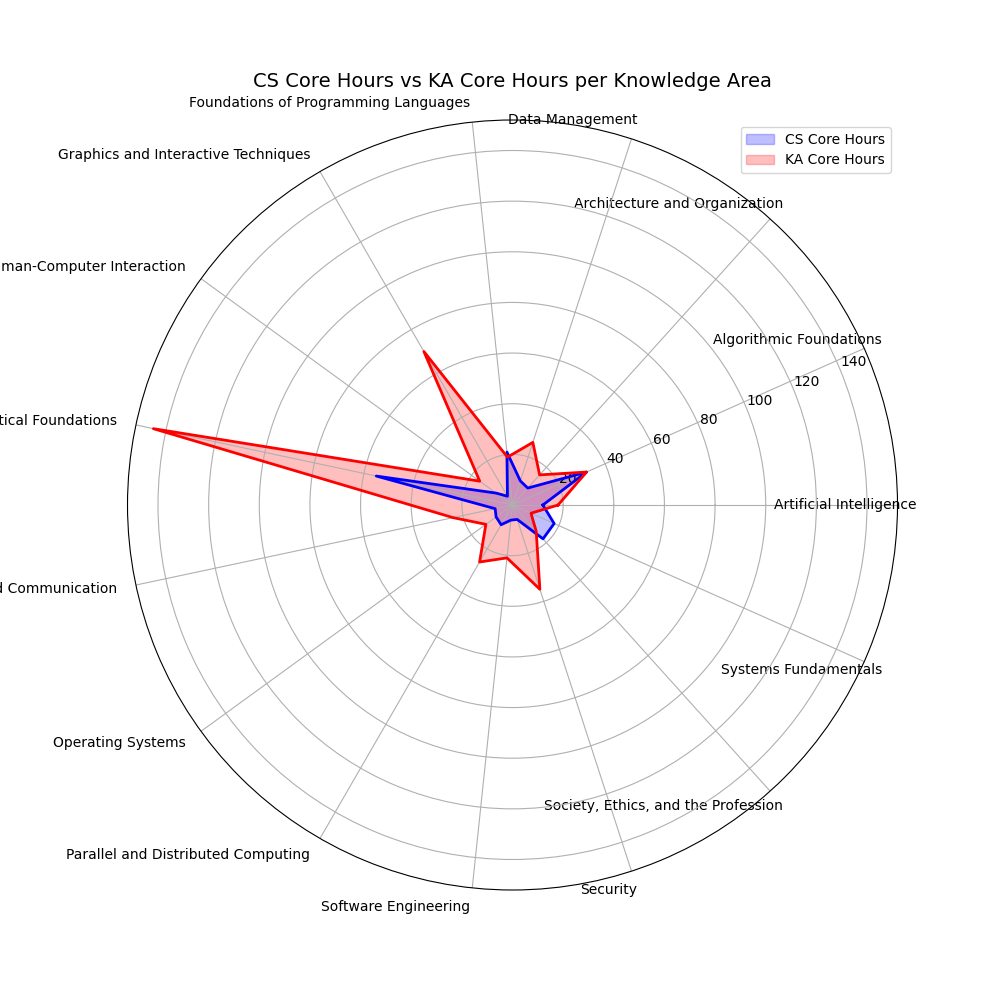

This is a demo scenario for [SPARQLLM](https://github.com/GDD-Nantes/SPARQLLM), a Retrieval-Augmented SPARQL Query engine. A video of the demo is available on [YouTube](https://www.youtube.com/watch?v=Oob2ci2TsGE). The demo has been accepted to [ESWC2025](https://2025.eswc-conferences.org/).


# Input

* `./data/BodyOfKnowledge` (BOK) is the extraction of Knowledge Units (KU) from [https://csed.acm.org/], aggregated per Knowledge AREA (KA). Knowledge Unit as TXT file in Knowledge Are directories.

* `./data/courses.ttl` is a knowledge graph representation of an (old) Master Program in Computer Science at University of Nantes. The objective is to align the UE of the Nantes curricula (NC) to the KU of BOK.
SPARQLLM is used to implement a pipeline that:
- enumerate UEs from NC
- Find 3 KU candidates with Vector Search
- Ask LLM to confirm if really the UE is aligned to KU and why. 

The ouput is a alignement of UE to KU that can be displayed on a radar view.



# Index the Body Of Knowledge 

install with virtualenv (recommended):
```
virtualenv xp-env
source xp-env/bin/activate
pip install -r requirements.txt
```
## Cloner mon répertoire Converter Notebook

Pour récupérer mon outil de conversion, exécutez :
```bash
git clone https://github.com/Ilef-mhabrech/converter_notebook.git


To follow SPARQLLM updates, you can update SPARQLLM with `pip install --upgrade git+https://github.com/GDD-Nantes/SPARQLLM.git` (@branch_name for a branch) 
Sometimes, i need "pip install --no-cache-dir --force-reinstall git+https://github.com/GDD-Nantes/SPARQLLM.git"


Need Ollama installed, For Linux, MacOS:
```
curl -fsSL https://ollama.com/install.sh | sh
ollama serve &
ollama pull llama3.1:latest
ollama pull nomic-embed-text
```

Index the Body of Knowledge:
```
slm-index-faiss --txt-folder ./data/BodyOfKnowledge --faiss-dir ./XP/bok_store --recurse 
```

# get the KG of graduation

* Master/Licence 2022: https://github.com/momo54/minfo2022 
* Licence 2025 : https://github.com/nourrekik/licence-maquettes-rdf 
* Master 2025 : https://github.com/Ilef-mhabrech/converter_notebook/tree/main 
* 

# run the query to align our cursus to BOK

Check config.bok to adjust parameter. Run the query (quite fast but limit 1):
```
slm-run  --config config.bok  -f queries/bok-graph-limit1.sparql --debug -o ./XP/bok.result --keep-store ./XP/bok.nq 
```

The same query with Constuct instead of select (long):
```
slm-run --config config.bok  -f queries/bok-graph-construct.sparql --debug -o ./XP/bokc.ttl --keep-store ./XP/bokc.nq
```

Notes: 
Faiss relies on  FlatIP to index with  normalisation. Score close to 1 is good, 0 or minus -> not similar

# run the UI to explore the results

User Interface to see SPARQLLM in action on the BOK Use-Case:
```
streamlit run scripts/HOME.py
```

